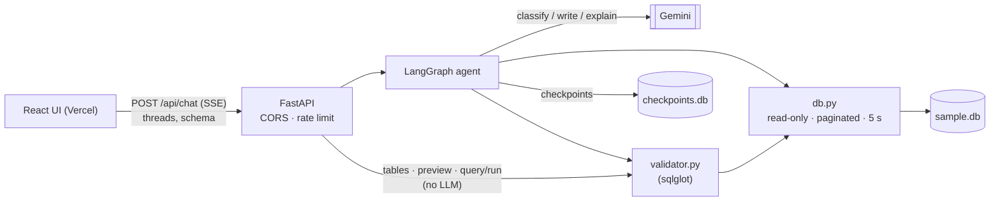
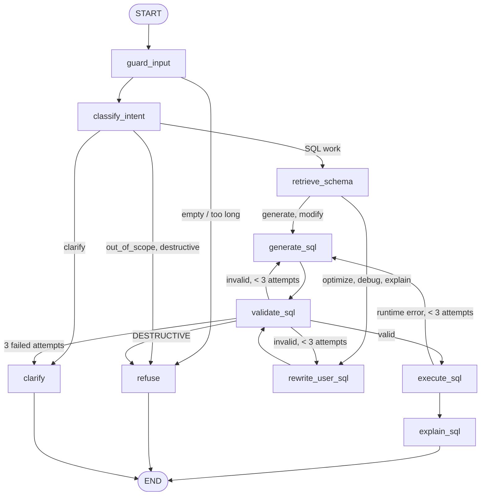

# SQL Query AI Agent — Backend

A LangGraph agent that turns plain-English questions into **validated, read-only SQL** over one
fixed database, optionally runs it, and explains it. It also optimizes, debugs and explains SQL
that users paste, keeps conversation context for follow-ups ("only those from California"), and
refuses anything outside SQL or anything that would write to the database.

**Workbench mode** ([CHANGES-v2.md](CHANGES-v2.md)) backs a MySQL Workbench-style UI: a table
browser with row counts, table previews, an editable SQL editor whose **Run** button executes
directly, paginated results, and the AI chat alongside. Follow-ups apply to whatever query is in
the editor. Table clicks and the Run button skip the LLM, **but never the validator**: every path
that executes SQL validates it first and uses the read-only connection.

**The LLM proposes, code disposes.** Gemini classifies, writes and explains. Deterministic code
(sqlglot + a read-only SQLite connection) decides whether a query is valid, whether it may run,
and what reaches the user.

| | |
|---|---|
| Frontend | https://sql-agent-frontend-delta.vercel.app (repo: [sql-agent-frontend](https://github.com/arpitgoyal20/sql-agent-frontend)) |
| Backend | https://sql-agent-backend-rg9t.onrender.com ([`/api/health`](https://sql-agent-backend-rg9t.onrender.com/api/health)) |
| Login | none needed |

## Contents

- [Architecture](#architecture)
- [LangGraph workflow](#langgraph-workflow)
- [Prompts](#prompts)
- [Database](#database)
- [Local setup](#local-setup)
- [API](#api)
- [Guardrails](#guardrails)
- [Tests and accuracy eval](#tests-and-accuracy-eval)
- [Deployment](#deployment)
- [Assumptions](#assumptions)

## Architecture



Full diagram and component table: [docs/architecture.md](docs/architecture.md).

## LangGraph workflow



- **Intents**: `generate`, `modify` (follow-up on the previous query), `optimize`, `debug`,
  `explain`, `destructive`, `out_of_scope`, `clarify`.
- **Retry loop**: validator errors such as
  `UNKNOWN_COLUMN: column 'age' does not exist. Columns available: Employees(...)` go back to the
  writer; after 3 failures the agent asks a clarifying question instead of returning bad SQL.
- **Memory**: a SQLite checkpointer per `thread_id`; only `messages` and `last_sql` carry between
  turns, and `last_sql` changes only when a query passes validation.
- **Only `validate_sql` sets `final_sql`.**

Node-by-node explanation: [docs/workflow.md](docs/workflow.md).

## Prompts

Loaded at runtime from [`prompts/`](prompts) and filled with `str.format`:

| Prompt | Used by | Output |
|---|---|---|
| [classifier.md](prompts/classifier.md) | `classify_intent` | structured `IntentDecision` |
| [generator.md](prompts/generator.md) | `generate_sql` | structured `SqlDraft` |
| [rewriter.md](prompts/rewriter.md) | `rewrite_user_sql` | structured `RewriteDraft` |
| [explainer.md](prompts/explainer.md) | `explain_sql` | streamed text + `ASSUMPTIONS:` block |
| [clarifier.md](prompts/clarifier.md) | `clarify` | one question |
| [few_shots.yaml](prompts/few_shots.yaml) | `generate_sql` | 8 NL→SQL examples (tested to validate and run) |

User text is always wrapped in `<user_message>…</user_message>` (closing tags inside are
escaped) and every prompt states that tag content is data, not instructions.

## Database

- Schema: [`data/schema.sql`](data/schema.sql). Departments, Employees (self-referencing
  managers), Customers, Products, Orders, OrderItems, Payments.
- Column descriptions: [`data/schema_docs.yaml`](data/schema_docs.yaml), added to prompts as comments.
- Data: [`data/sample.db`](data/sample.db), committed. It holds 8 departments, 200 employees (20% hired
  2024 or later), 500 customers in 10 states, 50 products in 6 categories, 2,000 orders,
  6,035 order items and 1,791 payments.
- `Orders.OrderDate`, `Orders.Status` and `Employees.HireDate` are deliberately unindexed so the
  optimizer has real index advice to give.

Regenerate (deterministic, byte-identical output):

```bash
python scripts/seed.py
```

To use another schema, replace `data/sample.db` (and `schema_docs.yaml`); the prompts and the
validator are built from the database at startup.

## Local setup

Requires Python 3.11+. Dependencies are in a plain `requirements.txt`.

```bash
python3.11 -m venv .venv
source .venv/bin/activate
pip install -r requirements.txt

cp .env.example .env          # then set GOOGLE_API_KEY (GEMINI_API_KEY also works)
python scripts/seed.py        # optional: sample.db is already committed

uvicorn app.main:app --reload --port 8000
curl localhost:8000/api/health   # {"status":"ok"}
```

Try every intent from the terminal (same event stream as the API):

```bash
python -m app.cli "Show all employees hired after January 2024"
python -m app.cli                      # REPL; /new starts a new thread, /quit exits
python -m app.cli --dialect postgres --no-execute "Top 5 customers by revenue"
python -m app.cli --raw "Who won the FIFA World Cup?"   # raw SSE events as JSON
```

Tests (no API key needed) and Docker:

```bash
pytest
docker build -t sql-agent-backend .
docker run -p 8000:8000 --env-file .env sql-agent-backend
```

### Environment variables

| Variable | Default | Purpose |
|---|---|---|
| `LLM_PROVIDER` | `google` | `google`, `openai` or `groq` (the last two need `langchain-openai` / `langchain-groq`) |
| `LLM_MODEL` | `gemini-3.5-flash-lite` | model name |
| `GOOGLE_API_KEY` / `GEMINI_API_KEY` | — | Gemini key |
| `LLM_THINKING_BUDGET` | unset | optional cap on Gemini thinking tokens |
| `ALLOWED_ORIGINS` | empty | optional extra CORS origins, comma-separated. The deployed frontend (`https://sql-agent-frontend-delta.vercel.app`) and `localhost` on any port are allowed in code ([`app/config.py`](app/config.py)) |
| `CHECKPOINT_DB` | `data/checkpoints.db` | LangGraph checkpoints + threads index |
| `SAMPLE_DB` | `data/sample.db` | the read-only database |
| `RATE_LIMIT` | `20/minute` | per-IP limit on `POST /api/chat` and `/api/execute` |
| `LANGSMITH_TRACING`, `LANGSMITH_API_KEY`, `LANGSMITH_PROJECT`, `LANGSMITH_WORKSPACE_ID` | off | optional tracing |

## API

Every `/api` request except `GET /api/health` must send `X-Client-Id: <uuid>` (the frontend
generates one per browser). Missing or malformed → `400`. Threads and saved queries are visible
only to the client that created them; another client's thread id behaves like a missing one (404).
Rate limits are keyed by client id (falling back to IP).

| Method | Path | Description |
|---|---|---|
| POST | `/api/chat` | `{thread_id, message, dialect, execute, current_sql?}` → Server-Sent Events. `current_sql` is the editor's query: if valid and different from the thread's last query it becomes the query follow-ups modify (a preview's `LIMIT 100` is stripped first) |
| GET | `/api/threads` | `[{thread_id, title, updated_at}]`, newest first |
| GET | `/api/threads/{id}` | `{messages: [{role, content, intent, sql, kind, created_at}], last_sql}` |
| DELETE | `/api/threads/{id}` | delete a thread (204) |
| PATCH | `/api/threads/{id}` | `{title}` → rename |
| POST | `/api/threads/{id}/duplicate` | copy messages and last SQL into a new thread |
| GET | `/api/tables` | `{tables: [{name, row_count, columns: [{name, type, pk, fk: {table, column} \| null, nullable, doc}], foreign_keys}]}`; row counts computed once at startup |
| GET | `/api/tables/{name}/preview?limit=100&offset=0` | `SELECT *` page of one table: `{sql, columns, rows, row_count, total, limit, offset, elapsed_ms}`; unknown name → 404 `{"error": "UNKNOWN_TABLE", "available": [...]}`. SQL is built from the schema's canonical name, never the raw path |
| POST | `/api/query/run` | `{sql, dialect, limit, offset}` → always 200 with `status`: `ok` (page + `total`, `elapsed_ms`, `warnings`), `invalid` (validator `errors`), `refused` (standard destructive text) or `error` (timeout / database error). No LLM; 60/min |
| POST | `/api/execute` | `{sql, dialect}` → validate and run directly (**no LLM**): `{ok, sql, errors, warnings, validation, inspection, result}` |
| GET / POST / DELETE | `/api/saved`, `/api/saved/{id}` | saved queries (`{title, prompt, sql, dialect, explanation}`; SQL must pass the validator) |
| GET | `/api/schema` | same payload as `/api/tables` (kept for older clients) |
| GET | `/api/health` | `{status: "ok"}` |

Thread titles start as the first 60 characters of the first message and are replaced by a short
title the classifier generates on that first turn (for example `Monthly Revenue — 2025`).

SSE events, in order: `step` (each node start/finish), `intent`, `sql`, `result`, `token`…,
`explanation`, or `clarify` / `refusal` / `error`, and always `done` last.

Beyond the brief's contract (additive only), the `sql` event also carries:
- `validation`: the checklist the query passed;
- `inspection`: tables, columns, joins, filters, aggregations, grouping, ordering and limit, for
  the UI's Query Inspector;
- `modified_previous`: true for follow-ups;
- `original_sql`: the user's query in optimize/debug mode;
- `executed_sql`: for PostgreSQL/MySQL, the translated SQLite that ran (null for SQLite).

When a PostgreSQL/MySQL query uses a feature SQLite lacks, the `result` event has empty rows and
an `error` such as "This PostgreSQL feature isn't supported on the SQLite demo database."
`/api/query/run` returns the same text with `status: "error"`, plus `executed_sql`.

A `step` with `status: "retry"` carries the validator `errors` that caused the retry. The `result`
event is the first page (100 rows) plus `total`, `limit` and `offset`; further pages come from
`POST /api/query/run` with the same SQL, without another LLM call.

Example turn:

```
event: step         data: {"node": "classify_intent", "status": "start", "label": "Understanding request"}
event: intent       data: {"intent": "generate"}
event: sql          data: {"sql": "SELECT ...", "dialect": "sqlite", "warnings": [], "optimization_notes": [], "index_suggestions": [], "issues": [], "removed_joins": []}
event: result       data: {"columns": [...], "rows": [[...]], "row_count": 40, "truncated": false}
event: token        data: {"text": "This lists "}
event: explanation  data: {"text": "...", "assumptions": ["..."]}
event: done         data: {"thread_id": "...", "intent": "generate"}
```

## Guardrails

| Guarantee | Layers |
|---|---|
| Never runs or returns destructive SQL | classifier intent `destructive` → fixed refusal · pasted SQL checked by the validator overrides the LLM · AST check for any write node anywhere (CTEs, after `;`, `SELECT INTO`, `PRAGMA`, `ATTACH`, `VACUUM`, `load_extension()`) → refusal · `mode=ro` + `PRAGMA query_only` connection |
| No hallucinated tables/columns | prompt schema is introspected from the DB · validator checks tables and runs `qualify` with the same schema · `EXPLAIN QUERY PLAN` on SQLite · errors fed back for up to 3 retries, then a clarifying question |
| Every returned query was validated | only `validate_sql` sets `final_sql` / `last_sql`; the `sql` event is emitted only from that node's success |
| Out-of-scope requests refused | classifier `out_of_scope` → fixed text from the brief, no LLM in the refusal |
| Prompt injection | regex patterns in `guard.py`; a match with no SQL and no schema names is refused **before any LLM call**; otherwise the classifier is warned · user text wrapped in escaped `<user_message>` tags · any output still has to pass the validator and the read-only DB |
| Resource limits | 4,000-char chat input · 10,000-char editor SQL · one statement per query · results paginated (≤ 500 rows per page) · 5 s query timeout · 20 chat / 60 query requests per minute per client |
| Editor and table browser | `/api/query/run` and table previews skip the LLM but not the validator: writes return `refused`, invalid SQL returns the validator errors, nothing unvalidated runs; table names are resolved against the schema, never interpolated |
| Ambiguity | `clarify` intent, and after 3 failed validations, asks one question naming real tables/columns |
| Index advice is advice | suggestions must parse as `CREATE INDEX` on existing, currently unindexed columns; they are displayed, never executed |

## Tests and accuracy eval

```bash
pytest            # 311 tests, no API key
```

| File | Covers |
|---|---|
| [test_validator.py](tests/test_validator.py) | every destructive statement type (incl. hidden in CTE / after `;`, PRAGMA, ATTACH), unknown table/column, ambiguous column, valid CTEs/subqueries/aliases/`SELECT *`/ORDER BY alias/UNION/self-join, non-FK join warning, postgres + mysql |
| [test_guard.py](tests/test_guard.py) | injection patterns flagged, normal questions not flagged, tag escaping, SQL extraction |
| [test_routing.py](tests/test_routing.py) | every router, attempts cap, DESTRUCTIVE short-circuit |
| [test_graph.py](tests/test_graph.py) | full graph with a scripted fake LLM: generate, modify, optimize, debug, explain, destructive, out_of_scope, clarify, injection, retry-then-success, 3 failures → clarify, execution off, postgres, editor query as previous SQL (preview limit stripped), editor button messages, paginated result |
| [test_tables.py](tests/test_tables.py), [test_query_run.py](tests/test_query_run.py) | table list + row counts, previews and paging, name-injection attempts, editor runs: paging, refusals, invalid, postgres, timeout |
| [test_client_isolation.py](tests/test_client_isolation.py) | `X-Client-Id` required (not on health), 400 keeps CORS headers, clients cannot see each other's threads or saved queries |
| [test_api.py](tests/test_api.py) | health, schema, SSE order ending in `done`, threads list/reload/rename/duplicate/delete, generated titles, `/api/execute`, saved queries, 422, rate limit, CORS |
| [test_db.py](tests/test_db.py), [test_schema_loader.py](tests/test_schema_loader.py), [test_events.py](tests/test_events.py), [test_prompts.py](tests/test_prompts.py) | read-only DB, row cap, timeout, introspection, token filter, few-shots and golden SQL are valid |

**Accuracy eval**: [`eval/golden.jsonl`](eval/golden.jsonl) has 25 questions with expected SQL.
[`scripts/run_eval.py`](scripts/run_eval.py) runs each through the real graph, executes the
generated and the expected SQL, and compares result sets (order-insensitive unless the expected
SQL has `ORDER BY`; extra columns tolerated).

```bash
python scripts/run_eval.py --delay 5
```

**Pass rate: 24/25 (96%)** with `gemini-3.5-flash-lite` (721 s on the Gemini free tier).
The one failure was in the golden answer, not the agent: "each employee with their manager's
name" expected an inner join, which drops the 8 top-level employees; the agent's `LEFT JOIN`
keeps them. The expected SQL has since been corrected to `LEFT JOIN`.

## Deployment

Render → New Web Service → this repo → Runtime **Docker**.

- Health check path: `/api/health`
- Environment: `GOOGLE_API_KEY`, `LLM_MODEL=gemini-3.5-flash-lite` (CORS for the Vercel frontend is set in code)
- `sample.db` is baked into the image; `checkpoints.db` is created at runtime.

## Assumptions

- **Schema.** The brief referenced a provided schema that was not attached, so a sample schema
  was designed. It can be swapped by replacing `sample.db`.
- **Execution engine.** PostgreSQL and MySQL are supported for generation and validation;
  execution translates them to SQLite and runs them on the sample database. The SQLite that
  actually ran is returned as `executed_sql` (shown in the UI's Notes tab). If a valid PostgreSQL
  or MySQL query uses a feature SQLite lacks (e.g. regex `~`, `ARRAY_AGG`, `EXTRACT`), the turn
  keeps the generated SQL and reports "This PostgreSQL feature isn't supported on the SQLite demo
  database" instead of rewriting a query that may well be correct; SQLite-dialect runtime errors
  are still fed back to the generator for a retry.
- **Limits.** Results are paginated: chat results arrive as the first 100 rows plus the total, and
  the editor/preview fetch pages of up to 500 rows. Queries time out after 5 s (the page and its
  `COUNT(*)` share that budget).
- **Workbench decisions.** `/api/health` needs no `X-Client-Id`, because Render's health check
  cannot send headers. Saved queries are isolated per client, like threads. Threads created
  before client ids existed have no owner and are no longer listed. A preview's `LIMIT 100`
  (offset 0) is stripped when the editor query becomes the chat's previous SQL; any other limit
  is the user's own and is kept.
- **Index suggestions** are advice only. Nothing except SELECT is ever executed.
- **Memory.** Conversation memory is lost on server restart on free hosting (`checkpoints.db`
  is ephemeral).
- **Login.** None required.
- **Model.** The brief fixes `gemini-2.5-flash`, but Google no longer serves it to new API keys
  (404 "no longer available to new users"). The default is `gemini-3.5-flash-lite`; set
  `LLM_MODEL` to change it. The client uses the provider's default temperature, as Gemini 3
  models are tuned for it.
- **Additions to the brief.**
  - **State fields:** `AgentState` has extra fields for routing and display: `refusal_reason`,
    `injection_patterns`, `writer`, `user_sql_findings`, `fixes`, `removed_joins`, `exec_sql`,
    `executed`, `execution_error`.
  - **Prompt text:** the prompts add a data-not-instructions line, a no-markdown output line, an
    explicit date convention ("after January 2024" means `>= '2024-01-01'`), and a
    `{guard_note}` used when injection patterns match.
  - **Stream modes:** the API adds the `tasks` stream mode to `updates`/`messages`, to get node
    *start* events for `step`.
  - **`explain` intent:** a valid pasted query is passed through by code (no LLM rewrite).
    A broken one is handled as `debug`, because the brief requires every returned query to pass
    validation.
  - **Debug and optimize findings:** `rewrite_user_sql` validates the user's SQL in all three
    rewrite modes, not only `debug`, so optimize also gets the findings.
  - **Reloaded threads:** saved messages are `{role, content, intent, sql, kind, created_at}`.
    `kind` is `answer`, `clarify` or `refusal`; for refusals, `intent` holds the refusal reason.
- **Input length and refusals.** Over-long (>4,000 chars) or empty input is refused inside the
  graph with `reason: "out_of_scope"` and a specific message. The transport limit is 20,000
  chars, so the user gets a readable refusal instead of HTTP 422.
- **Database check for other dialects.** `EXPLAIN QUERY PLAN` (validator step 7) runs only for
  the SQLite dialect, as written in §8. PostgreSQL/MySQL queries are translated to SQLite, and a
  translation or runtime failure is reported like a validation error.
- **Multiple statements.** A multi-statement input that contains a write reports both `MULTI`
  and `DESTRUCTIVE`, so routing refuses outright instead of retrying.
- **Rate limit.** In-memory and per client IP (uvicorn runs with `--proxy-headers` behind
  Render's proxy). It resets on restart and is not shared across instances.
- **sqlglot workaround.** sqlglot 27 drops CTE column lists when writing SQLite;
  [`app/sqlglot_compat.py`](app/sqlglot_compat.py) restores them.
