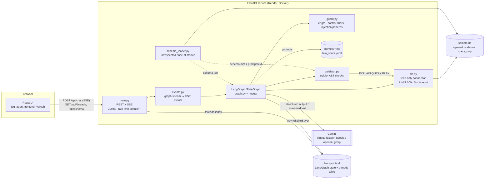

# Architecture

## Components

| Component | Responsibility |
|---|---|
| [`app/main.py`](../app/main.py) | FastAPI routes, CORS from `ALLOWED_ORIGINS`, `slowapi` rate limit on `/api/chat`, SSE via `sse-starlette`, `threads` table for the sidebar. |
| [`app/events.py`](../app/events.py) | Runs one turn and turns the LangGraph stream into the SSE events of the API contract. Shared with the CLI. |
| [`app/graph.py`](../app/graph.py), [`app/nodes/`](../app/nodes) | The agent: routing, retries, refusal and clarification paths. See [workflow.md](workflow.md). |
| [`app/validator.py`](../app/validator.py) | Deterministic validation: parse, single statement, read-only, tables, columns (`sqlglot.optimizer.qualify`), FK joins (warning), `EXPLAIN QUERY PLAN`. Also index-advice and table-diff helpers. |
| [`app/guard.py`](../app/guard.py) | Input hygiene and prompt-injection patterns; wraps user text in `<user_message>` tags with closing tags escaped. |
| [`app/schema_loader.py`](../app/schema_loader.py) | Reads tables, columns, FKs and indexes from `sqlite_master` and `PRAGMA`s, merges `schema_docs.yaml`. The validator and the prompts both use it, so they cannot disagree. |
| [`app/db.py`](../app/db.py) | Read-only connections (`mode=ro` + `PRAGMA query_only`), progress-handler timeout, AST row cap. Never used for checkpoints. |
| [`app/llm.py`](../app/llm.py) | Model factory (`LLM_PROVIDER`, `LLM_MODEL`) and prompt loading. |
| [`app/sqlglot_compat.py`](../app/sqlglot_compat.py) | Keeps CTE column lists when sqlglot writes SQLite (`WITH RECURSIVE n(i)`), which sqlglot 27 otherwise drops. |

## Data stores

- **`data/sample.db`**: the queried database. Built by `scripts/seed.py` (deterministic), committed,
  baked into the Docker image, and only ever opened read-only.
- **`data/checkpoints.db`**: LangGraph checkpoints plus the `threads` index. Created at runtime;
  on free hosting it is lost on restart.

## Defence in depth for "never destructive"

1. **Intent**: the classifier labels write requests `destructive` → fixed refusal.
2. **Code override**: pasted SQL that the validator flags as destructive forces `destructive`.
3. **AST**: the validator rejects any write node anywhere in the tree (including inside CTEs, after
   `;`, `SELECT … INTO`, `PRAGMA`, `ATTACH`, `load_extension()`), and routing refuses on it.
4. **Database**: the connection is `mode=ro` with `PRAGMA query_only = ON`, so even a query that
   slipped past everything above cannot write.
