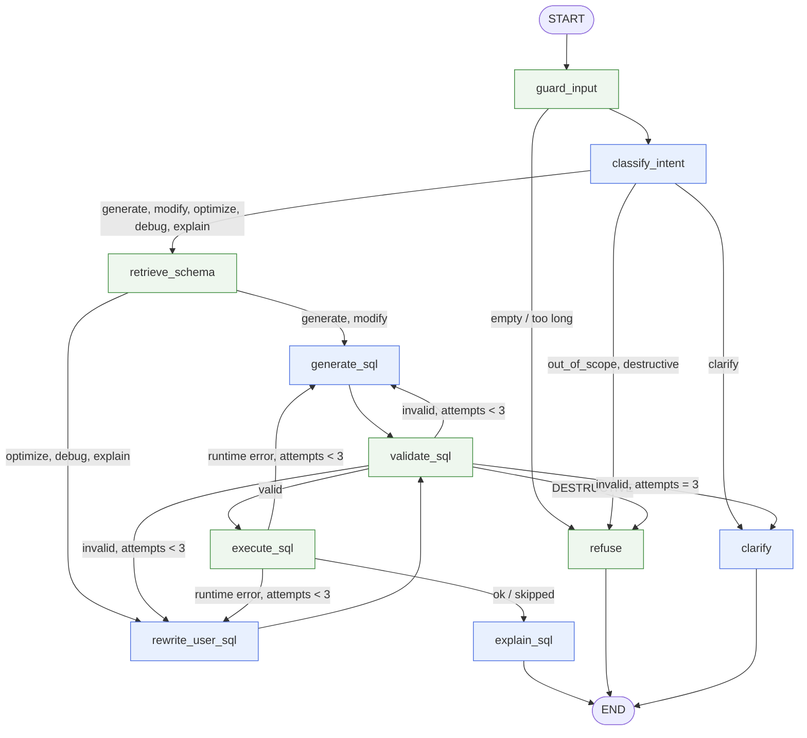

# LangGraph workflow

The agent is one `StateGraph` ([app/graph.py](../app/graph.py)) over `AgentState`
([app/state.py](../app/state.py)). Each user message is one run of the graph on a thread; the
SQLite checkpointer stores the state between runs, so conversation history and the last valid
query carry into the next turn.

The rule throughout: **the LLM proposes, code disposes.** LLM nodes classify, write and explain.
Code nodes decide what is valid, what runs, and what the user sees.



Blue nodes call the LLM; green nodes are deterministic code.

## Nodes

| Node | Kind | What it does |
|---|---|---|
| `guard_input` | code | Resets every per-turn field (only `messages` and `last_sql` carry over), strips control characters, refuses empty or >4,000-char input, and records prompt-injection pattern matches. Appends the user message to history. |
| `classify_intent` | LLM, structured | Returns `IntentDecision {intent, user_sql, refers_to_previous, reason}`. Code then corrects what it can check: an injection match with no SQL and no schema names is `out_of_scope` **without calling the LLM**; pasted SQL the validator flags as destructive becomes `destructive`; `optimize/debug/explain` without pasted SQL use the previous query (or `clarify` if there is none); `modify` with no previous query becomes `generate`. |
| `refuse` | code | Fixed texts from §9, no LLM. Reason is `destructive` when the intent or a validator error says so, otherwise `out_of_scope`. |
| `clarify` | LLM, text | One question offering real tables/columns. Also the exit after three failed validations, with those errors in the prompt. |
| `retrieve_schema` | code | Picks tables by matching names, singular/plural forms, CamelCase column parts and domain words ("revenue" → OrderItems, "California" → Customers) in the message, the pasted SQL and, for follow-ups, the previous SQL; adds FK neighbours; falls back to all 7 tables. Writes `CREATE TABLE`-style text with column docs and FK lines. |
| `generate_sql` | LLM, structured | `SqlDraft {sql, assumptions}` for `generate`/`modify`. Gets the schema, 8 few-shot examples, the previous SQL for follow-ups, and the previous attempt's validator errors. Increments `attempts`. |
| `rewrite_user_sql` | LLM, structured | For the user's own SQL. Validates it first and passes the findings into the prompt (so a broken query in `debug` is expected input, not a failure). `explain` of a valid query is passed through by code with no LLM call; `explain` of a broken query is switched to `debug`. Returns `RewriteDraft {sql, issues, fixes, optimization_notes, index_suggestions, removed_joins}`. |
| `validate_sql` | code | Runs [the validator](../app/validator.py). On success it is the **only** place `final_sql` and `last_sql` are set. For `optimize` it also keeps only index advice that is real (parses as `CREATE INDEX` on existing, not-yet-indexed columns), adds advice derived from the final query's WHERE/JOIN/ORDER BY columns, and computes removed joins by diffing the tables in the user's query and the final query. |
| `execute_sql` | code | Runs the SQLite form of the query on a read-only connection with `LIMIT 200` and a 5 s timeout, or skips when execution is off. Runtime errors are fed back like validation errors. |
| `explain_sql` | LLM, streamed | 2–4 plain sentences plus an `ASSUMPTIONS:` block, streamed token by token. The API stops forwarding tokens at the marker so assumptions arrive only in the final `explanation` event. |

## Retry loop

`validate_sql` writes its errors to `validation_errors`, and the writer node that produced the
candidate (`state.writer`) gets them back in its next prompt. Error strings are written for
that purpose, for example:

```
UNKNOWN_COLUMN: column 'age' does not exist. Columns available: Employees(EmployeeID, FirstName, ...)
UNKNOWN_TABLE: Employee. Did you mean Employees? Available: Departments, Employees, ...
UNKNOWN_COLUMN: column 'customerid' is ambiguous; it exists in Customers and Orders. Qualify it ...
```

After three attempts the turn ends in `clarify`; an invalid query is never returned. A
`DESTRUCTIVE` error ends the turn in `refuse` immediately, whatever the attempt count.

## Conversation memory

- **Checkpointer**: `AsyncSqliteSaver` on `CHECKPOINT_DB` (default `data/checkpoints.db`), a
  different file from the read-only `sample.db`. Thread id = the frontend's `thread_id`.
- **Carried over**: `messages` (user and assistant messages; assistant messages carry `intent`,
  `sql`, `kind` and `created_at` metadata for reloading a chat) and `last_sql`.
- **Follow-ups**: the classifier sees the last 6 messages and the previous SQL; when the intent is
  `modify`, the generator is told to start from `last_sql` and change only what was asked
  ("Show all customers" → "Only those from California" adds `WHERE State = 'California'`).
- `last_sql` only changes when a query passes validation, so a failed turn never poisons the next.

## Streaming

[app/events.py](../app/events.py) runs `graph.astream(stream_mode=["updates", "messages", "tasks"])`
and maps it to the SSE events of §12. `tasks` provides node starts (`step … start`), `updates`
provide node results (`step … ok|retry|skip`, `intent`, `sql`, `result`, `clarify`, `refusal`,
`explanation`), and `messages` provides explainer tokens. `tasks` is added to the two modes named in
the brief because node *start* events are not available from `updates`. Every turn ends with
`done`, including after an `error`.
